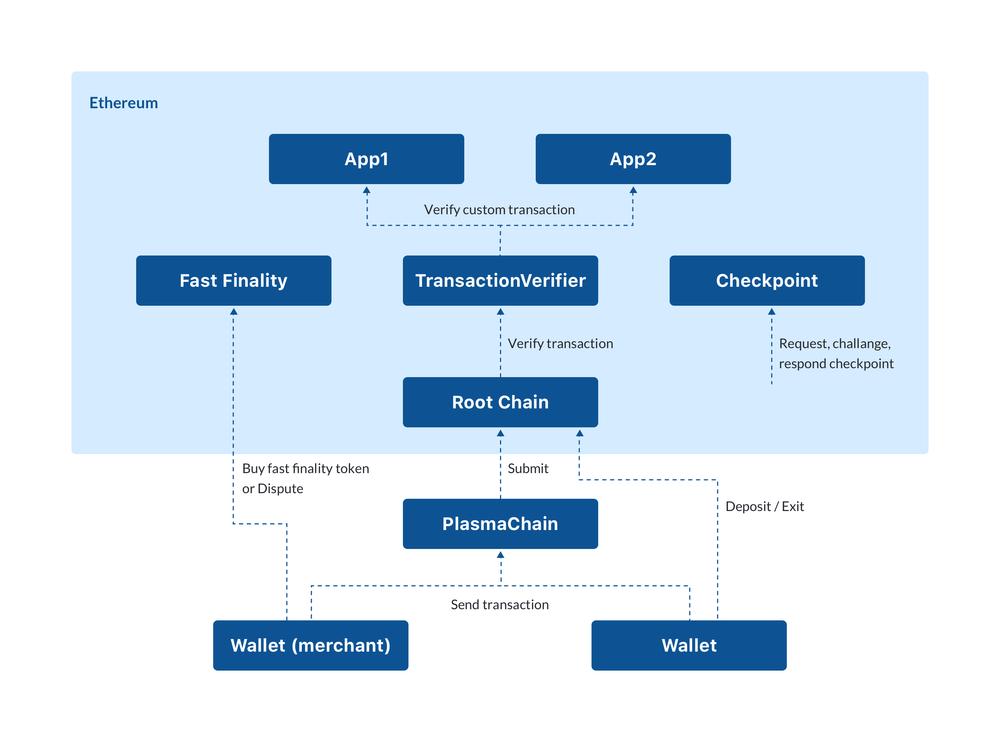

# Plasma Chamber

[](https://travis-ci.org/cryptoeconomicslab/plasma-chamber)
[](https://coveralls.io/github/cryptoeconomicslab/plasma-chamber?branch=master)

Plasma Chamber is a toolset that guarantees security, scalability, and versatility of Dapps development on Plasma.


**IMPORTANT NOTICE:** <br>
* **This is an experimental software, does not run in a production yet.**

* **Vyper contracts are [here](https://github.com/cryptoeconomicslab/plasma-chamber/tree/master/packages/contracts).**
<br />

**Table of Contents**

* [Introduction](#introduction)

* [Overview](#overview)

* [Getting Started](#getting-started)

* [Architecture](#architecture)

    * [Root Chain Contracts](#root-chain-contracts)
        * [Deposit](#deposit)
        * [Exit](#exit)
        * [Challenge](#challenge)

    * [Child Chain](#child-chain)  
        * [Tx Verification](#tx-verification)
        * [Plasma Block Generation and Submission](#plasma-block-generation-and-submission)

    * [Wallet](#wallet)
        * [History Verification](#history-verification)
        * [Guard Feature](#guard-feature)
        * [Wallet SDK](#wallet-sdk)

* [Plasma Chamber Implementation Design](#plasma-chamber-implementation-design)
	* [Key Features](#key-features)
		* [Defragmentation](#defragmentation)
		* [Fast Finality](#fast-finality)
		* [Checkpoint](#checkpoint)
		* [Custom Transaction](#custom-transaction)

	* [Security Guarantees](#security-guarantees)
		* [Simple Exit Game](#simple-exit-game)
		* [Specific Exit Game for Custom Transactions](#specific-exit-game-for-custom-transactions)
		* [Longer Online Requirement](#longer-online-requirement)

* [Implementation Schedule](#implementation-schedule)
	* [Demo Gadgets](#demo-gadgets)
	* [User Generated Contracts](#user-generated-contracts)

# Introduction
Plasma Chamber is Cryptoeconomics Lab's first product that enables to generate General Purpose Plasma. Our implementation used [Plasma Cashflow](https://medium.com/plasma-group/plasma-spec-9d98d0f2fccf) design as its basis, but support more complex transactions for each decentralized application without sacrificing its security.

# Overview
Plasma is a 2nd layer scaling solution focusing on throughput improvement rather than quick finality. Plasma is not an EVM based, but a UTXO-model based scaling solution inheriting Ethereum blockchain's security. In other words, it aims to give a perfect fund safety, a transaction compression. Plasma is often times expected to be applied to several kinds of Dapps such as games, asset exchanges, etc. However, it requires production teams to employ expert Plasma researchers for careful security analysis in order to prepare their infrastructure. This causes duplicated research for each project, and security insights would not be shared sufficiently and efficiently amongst the projects. Hence, in order to solve this problem, Plasma Chamber is implemented to be a Dapp building framework without requiring domain-specific Plasma for each project.

# Getting Started

## Requirements

You need to install them before deploying Plasma Chamber contracts. 

* Node.js v8.11.3 or higher
    * You can install Node.js from here; https://nodejs.org/en/
* ganache-cli latest version
    * You need to install npm or Yarn first 
    * how to install ganache-cli; https://github.com/trufflesuite/ganache-cli#installation 
* Vyper 0.1.0b8
    * You need to install Python v3 or higher into your OS first (make sure to check the prerequisites on the official installation doc; https://vyper.readthedocs.io/en/latest/installing-vyper.html#prerequisites)
    * how to install Vyper; https://vyper.readthedocs.io/en/latest/installing-vyper.html#installation
* Other package management tools / Ethereum testing framework
    * npm 
    * lerna
    * yarn 
    * lerna bootstrap 
    * truffle

## Deploy contracts

Run ganache with test mnemonic
```sh
ganache-cli --mnemonic 'candy maple cake sugar pudding cream honey rich smooth crumble sweet treat'
```

deploy contracts.

```sh
npm i lerna yarn -g
git clone https://github.com/cryptoeconomicslab/plasma-chamber
cd plasma-chamber 
lerna bootstrap
cd packages/contracts
yarn build
truffle migrate --network local
```

## Run plasma chain

```sh
cd packages/operator
cp ../../.env.sample ./.env
node -r dotenv/config lib/entry
```

Or you can install global module.

```sh
npm i @layer2/operator -g
ROOTCHAIN_ENDPOINT=http://127.0.0.1:8545 ROOTCHAIN_ADDRESS=0xeec918d74c746167564401103096d45bbd494b74 OPERATOR_PRIVATE_KEY=0xc87509a1c067bbde78beb793e6fa76530b6382a4c0241e5e4a9ec0a0f44dc0d3 layer2-operator
```

Or use docker image.

```sh
docker run -e 'ROOTCHAIN_ADDRESS='{root chain address}' -e 'OPERATOR_PRIVATE_KEY={private key}' -e 'ROOTCHAIN_ENDPOINT='{endpoint}' -v /path/to/db:/var/plasmadb  -itd -u node cryptoeconomicslab/plasma-chamber:development
```

You need envs described [here](https://github.com/cryptoeconomicslab/plasma-chamber/tree/master/packages/operator#environment-variables)


## Run wallet

```sh
git clone https://github.com/cryptoeconomicslab/plasma-wallet
cd plasma-wallet
yarn install
cp .env.example .env
yarn start
```

Open http://localhost:1234 in browser.

# Architecture

Plasma Chamber's architecture enables service providers and its users to take advantage of lower transaction costs and higher throughput without sacrificing security derived from the rootchain. This is accomplished by process of compacting multiple transaction data on a child chain block and submitting it to a root chain (Ethereum blockchain in our case). The diagram below illustrates the connection between the wallets of service provider/ users and Plasma Chamber on top of Ethereum blockchain as its root chain.<br>
<br>

## Root Chain Contracts
### Deposit
Any Ethereum address may deposit Eth or other fungible token into the root chain contract. Then such deposits send the equivalent amount of pseudo Eth/ERC20 to the child chain contract. Those deposited funds are recognized as a single UTXO on the child cain. Such UTXO can then be both spent on the child chain or exited to the root chain by users after a challenge period ends without a successful challenge completion.<br>

### Exit
As users request to withdraw their funds deposited on the root chain, child chain gives the equivalent amount of pseudo coins deposited on the child to the root chain, submitting the existence proof of the transaction to the root chain. This procedure is called ‘exit.’ Existence proof is consists of 3 different piece of information; Merkle Hash of Merkle Tree, in which the exiting transaction was included, Merkle proof, and the block height of the transaction.<br>

Please see  [Simple Exit Game](https://github.com/cryptoeconomicslab/plasma-chamber/wiki/Exit-Game) section for the details of our Exit and Challenge design, including Exit games.<br>

### Challenge
When transactions are in the process of exit requested by a user, another use can invalidate the transaction by "Challenge" action, presenting other transaction with true ownership. When the challenge was approved by the contract, then the exit get blocked.

## Child Chain
1. Uses UTXO model to transfer pseudo fungible coins with a unique id. <br>
2. Enables a PoA network, which is centrally controlled by a single party or entity called ‘operator.’ This enables high transaction throughput, while deriving the security robustness from the root chain.<br>

### Tx Verification
In the Child Chain network, the state of UTXO gets updated to the latest status everytime Child Chain receives Deposit, Blocksubmitte, ExitStarted events. This single party operation enables faster transactions verification and it returns the response to the client wallets faster.

### Plasma Block Generation and Submission
In the Child Chain network, an operator assembles transactions initiated by end users hash them into Merkle Root. Sum Merkle Tree gets constructed, defining transaction hash as its leaf and the output of transaction hash as its range. Then, Merkle Root is submited to Root Chain contract. In short, utilizing Sum Merkle Tree, thousands of transaction data can be reduced in to 32 bytes Merkle Root and get processed on the Main Chain as 1 transaction, resulting in the gas cost reduction.

## Wallet
### History Verification
* Client wallet conducts inspection of UTXO history data referring to events on the Root Chain contract and Merkle Proof submited by the Child Chain. This inspection is conducted whenever the wallet receives and uses new UTXOs. This is a distinct design which diffirenciates Plasma Chamber from any other sidechains  as a trustless sidechain, inheritating main chain security from the first layer.
* Compared to Plasma full nodes, Plasma Chamber significantly reduces the size of the history data that clients have to inspect with range chunking and checkpoint functions. The size of the history data with one UTXO is expected to be not more than a few mega bytes utmost. Also, with the defragmentation feature, data size that each client has to hold will not be more than a few mega bytes either since UTXOs will be chunk up into one UTXO.

### Guard Feature
Client wallet can detect invalid exit of a transaction which is related to some UTXO that the wallet owns while it becomes online at a regular interval.

### Wallet SDK
Cliet wallet can handle and generate not only transfer transactions, but also more complex transactions. We provide our wallet SDK, which include functions of history verification, guard feature, and syncronization of Root Chain and Child Chain data [here](https://cryptoeconomicslab.github.io/chamber-packages/wallet/classes/_wallet_.chamberwallet.html).

# Plasma Chamber Implementation Design
This section describes the feature of Plasma Chamber's protocol design.Plasma Cash model is the basis for our implementation, but several modifications proposed later in Plasma Cashflow and Plasma Prime design are incorporated. <br>

**Plasma Chamber has 4 key features and 3 security guarantees listed below.**

## Key Features
### Defragmentation
Plasma Chamber has intra-chain atomic swap and force inclusion property. These properties are implemented for the fragmentation of the [segment](https://scrapbox.io/cryptoeconimicslab/segment) of the coins. Defragmentation requires the intra-chain atomic swap first, then securing the safety of the exit game. The [Force Inclusion](https://hackmd.io/DgzmJIRjSzCYvl4lUjZXNQ?view#Atomic-Swap-Force-Include)function is required to mitigate newly introduced atomic swap feature. You can refer to [our docs](https://github.com/cryptoeconomicslab/plasma-chamber/wiki/Exit-Game#force-inclusionsegment-tx-proof-sigs-sigsindex) for more details of Force Inclusion function.
Current limitation requires of the end users who are swapping the segments of the coins to be online simultaneously for atomic swap. By making the operator as the broker of swap request matching, end users' online requirement would be mitigated. This update doesn't lower the fund security of Plasma, and incentivize the operator to maintain the chain defragmented.<br>
Please also see more of our documents on Defragmentation form [here](https://scrapbox.io/cryptoeconimicslab/Defragmentation). <br>

### Fast Finality
Allows customers to have better user experience of transaction confirmation.The fast finality bandwidth is sold via Merchant PoS wallet.<br>

``Finality``<br>
Finality means that once a transaction has been processed in a certain block, it will forever stay in history and nothing can revert that operation. This immutability of state transition will be especially important in the finance filed.<br>

Fast Finality function will only be available to limited third party service providers who hold wallets and control to transfer token values to users' wallets. Service clients can confirm their transaction's finality faster when the service providers buy Fast Finality Token from the operator (in this case, service providers are independent from the operator) and make a deal with them to include the transaction in a timely manner. In other words, the fast finality bandwidth is sold via merchandiser-wallet. If anything goes wrong within the network, service providers can challenge operators on the Fast Finality contract, claiming that the transaction was not included in the corresponding block.<br>
See [Fast Finality](https://github.com/cryptoeconomicslab/plasma-chamber/wiki/Plasma-Fast-Finality) section for the source code of this Fast Finality contract. The rough specification is in [Learn Plasma - Research](https://www.learnplasma.org/en/research/). <br>

### Checkpoint
Reduces the transaction history that each end user has to hold. <br>
Checkpoint reduces the amount of history data that each user need to keep on wallet, inheriting from [Plasma XT](https://ethresear.ch/t/plasma-xt-plasma-cash-with-much-less-per-user-data-checking/1926). Adding this to fungible Plasma Cash require careful analysis in order not to remain chain-wide mass exit probability. Via this checkpointing, we don't need to wait for the implementation of trusted setup RSA Accumulator nor trustless setup zk-STARKs.<br>
See [Checkpoint](https://github.com/cryptoeconomicslab/plasma-chamber/wiki/Plasma-Checkpoint) section for the source code.<br>

### Custom Transaction
Enables plapps-developers to build decentralized application that has more function than just a transfer transaction.<br>
The operator is able to set adhoc transaction verifiers and state verifiers. By this immutably appendable modules, Chamber is to be [#plapps](https://scrapbox.io/cryptoeconimicslab/plapps) framework in order to develop more than simple payment.<br>

## Security Guarantees
These properties are implemented as a Plasma Cash variant which supports fungibility of coins with range feature implemented by Sum Merkle Tree. At the same time, this design focuses on to utilize the security of original Plasma Cash design's robost security model to the maximum level.<br>

### Simple Exit Game
Our simple exit game, a non-intereactive security model was implemented inspired by [simpler-exit-game-for-plasma-cash](https://ethresear.ch/t/a-simpler-exit-game-for-plasma-cash/4917), which does not allow any randome patter of malicious exit and Mass Exit problem. It makes Plasma Chamber resilient to rearrangement+Withholding attacks. Since multi round challenge-response is not required for full security anymore, coin-wise priority queue guarantees each end user's fund from the operator. Also, our Simple Exit Game can be compatible with our Range Chunking feature. <br>
See [Simple Exit Game](https://github.com/cryptoeconomicslab/plasma-chamber/wiki/Exit-Game) section for the source code.<br>

### Specific Exit Game for Custom Transactions
Since various UTXO contracts are permitted on this Plasma childchain, the inputs and outputs of a tx can be more than one set unlike the original Plasma Cash design. For instance, swap, multisig, or escrow functions are the popular example of UTXO contracts. How to develop these contracts will be described in [Custom transaction and state verifier](https://scrapbox.io/cryptoeconimicslab/Custom_transaction_and_state_verifier).<br>

### Longer Online Requirement
Developers can choose to implement longer exit period. Even with a longer exit period, end users can withdraw their funds immediately as long as they can provide the history of the asset by the [Simple Fast Withdrawals](https://ethresear.ch/t/simple-fast-withdrawals/2128) function and verify themselves. On the other hand, clients will have to hold their history incrementing in proportion to the longer exit period.<br>


# Implementation Schedule
## Demo Gadgets
Those are outer-protocol inventions to be implemented Q2~Q3 of 2019 to improve the usability of Plasma Chamber.<br>
- Escrow with Trusted Third Party with repeated game enforcement<br>
- Escrow SDK, Tx format verifier, and extended exit game<br>
- Cloud Keystore as email-passphrase import enabler<br>
- DAI and LCJPY(LCNEM Inc.'s pseudo-hard-peg JPY Stablecoin) integration<br>
- Instant deposit from traditional mobile banking app
- Fee Model<br>
    - head-body Tx structure for enabling exit-game-safe fee model for both operator and contract developer
    - Only merge&swapTx can be ZeroFee in order to disincentivice fragmentation.
    - [GasToken](gastoken.io) based one year locked fee model to deal with the volatility of ETH price

## User Generated Contracts
After we release our first demo, we would like ask Dapps developers across the world to implement these functions through open-source contribution here. <br>
- MerchantWallet<br>
- BlockExplorer<br>
- Deployer: must return SDK and Documentation<br>
- UserExperienceTarget: 5 days for deploy<br>
